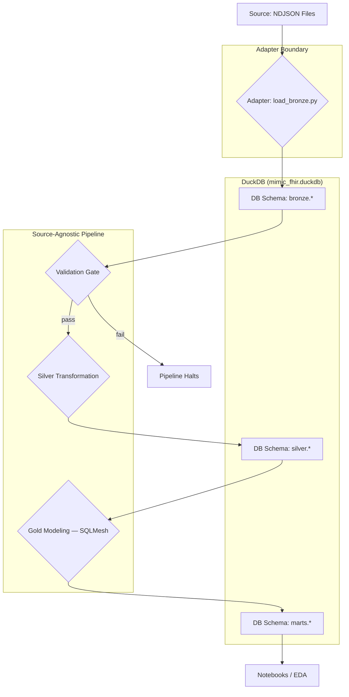

# MIMIC-FHIR Analytics Platform: Implementation Guide

This document describes the architecture and implementation of the MIMIC-FHIR analytics platform. It is a living document that guides development and ensures consistency.

## 1. Architectural Overview

The platform follows a **Medallion Architecture (Bronze, Silver, Gold)** implemented within a single, portable **DuckDB** database file. The entire environment is containerized with **Docker** for reproducibility.

- **Data Flow**: `Raw NDJSON -> Bronze (raw JSON) -> [Validation Gate] -> Silver (flat tables) -> Gold (analytical models) -> Notebooks`
- **Core Technologies**:
    - **DuckDB**: Embedded analytical database.
    - **Python**: For ingestion, validation, and orchestration.
    - **FlatQuack**: Reference tool — generates DuckDB SQL from FHIR ViewDefinition specs for documentation and pattern guidance (Silver layer).
    - **SQLMesh**: Manages the Gold layer (config-driven, YAML-based).
    - **Docker**: For containerization and environment consistency.



---

## 2. Project Structure

```
/
├── docker-compose.yml
├── Dockerfile
├── run_pipeline.sh
│
├── data/
│   ├── raw/                    # Raw FHIR NDJSON files (mounted read-only)
│   └── warehouse/              # DuckDB database file lives here
│
├── adapters/
│   └── mimic/
│       └── load_bronze.py      # Source-specific: MIMIC NDJSON → bronze.fhir_resources
│
├── pipeline/
│   ├── validate_bronze.py      # Validation gate (source-agnostic)
│   └── build_silver/
│       ├── sql/                # Hand-written SQL (source of truth, executed against DuckDB)
│       │   └── create_silver_observation_vitals.sql
│       └── apply_views.py      # Runs all SQL files in sql/
│
├── specs/                      # FlatQuack ViewDefinition inputs (.vd.json)
│   ├── silver_vitals_simple.vd.json
│   └── silver_vitals_bp.vd.json
│
├── models/                     # SQLMesh project root (Gold layer)
│   ├── config.yaml             # SQLMesh gateway + DuckDB connection
│   ├── external_models.yaml    # Declares silver.* tables as external
│   └── models/
│       ├── intermediate/
│       │   └── vitals_wide.sql
│       └── marts/
│           └── eda_vitals.sql
│
└── notebooks/                  # EDA notebooks read from marts.eda_vitals
```

---

## 3. Core Components & Implementation

### 3.1. Docker Setup

The `Dockerfile` sets up the Python environment. The `docker-compose.yml` orchestrates the service and manages data volumes.

**`Dockerfile`**
```dockerfile
FROM python:3.11-slim

RUN pip install --no-cache-dir duckdb sqlmesh[duckdb] pyarrow

WORKDIR /app
COPY ./adapters /app/adapters
COPY ./pipeline /app/pipeline
COPY ./models /app/models
COPY ./run_pipeline.sh /app/run_pipeline.sh
RUN chmod +x /app/run_pipeline.sh

ENV DUCKDB_PATH=/data/warehouse/mimic_fhir.duckdb
ENV RAW_DATA_PATH=/data/raw

ENTRYPOINT [ "/app/run_pipeline.sh" ]
```

**`docker-compose.yml`**
```yaml
services:
  pipeline:
    build: .
    volumes:
      - ./data/raw:/data/raw:ro
      - ./data/warehouse:/data/warehouse
```

### 3.2. Bronze Ingestion

**Goal:** Load raw FHIR NDJSON resources into a single queryable table in the `bronze` schema. Each row stores the full JSON resource alongside extracted metadata.

**File:** `adapters/mimic/load_bronze.py`

This is the source-specific adapter. It writes to the `bronze.fhir_resources` contract table that the rest of the pipeline reads from. Adding a new data source means writing a new adapter — nothing downstream changes.

```python
# adapters/mimic/load_bronze.py
import duckdb
import os
import re
import glob

db_path = os.environ["DUCKDB_PATH"]
raw_data_path = os.environ["RAW_DATA_PATH"]

con = duckdb.connect(db_path)

con.execute("CREATE SCHEMA IF NOT EXISTS bronze;")

# Full reload — no upsert needed for static data
ndjson_files = glob.glob(os.path.join(raw_data_path, "*.ndjson"))

if not ndjson_files:
    print("No NDJSON files found — skipping bronze ingestion.")
    con.close()
    exit(0)

# Build a UNION ALL across all source files
selects = []
for file_path in sorted(ndjson_files):
    filename = os.path.basename(file_path)

    # Sanitize filename before interpolation
    if not re.match(r"^[\w\-. ]+\.ndjson$", filename):
        print(f"Skipping file with unexpected name: {filename}")
        continue

    selects.append(f"""
    SELECT
        json_extract_string(json, '$.resourceType') AS resource_type,
        json_extract_string(json, '$.id') AS resource_id,
        json AS resource,
        '{filename}' AS source_file
    FROM read_json_auto('{file_path}', format='newline_delimited')
    """)
    print(f"  Queued {filename}")

con.execute(f"""
CREATE OR REPLACE TABLE bronze.fhir_resources AS
{" UNION ALL ".join(selects)}
""")

row_count = con.execute(
    "SELECT COUNT(*) FROM bronze.fhir_resources"
).fetchone()[0]
print(f"Bronze ingestion complete: {row_count:,} rows.")
con.close()
```

**Key design decisions:**
- **`CREATE OR REPLACE TABLE`** instead of upsert — MIMIC is a static dataset, so full reload is simpler and avoids the need for `UNIQUE` constraints that DuckDB doesn't enforce on `INSERT ... ON CONFLICT`.
- **Filename sanitization** — regex allowlist prevents SQL injection through filenames.
- **Single table with JSON column** — `bronze.fhir_resources` stores every resource type in one table, filtered downstream by `resource_type`. This avoids schema proliferation and keeps the bronze layer generic.

### 3.3. Bronze Validation Gate

**Goal:** Catch ingestion failures before they propagate to Silver. A lean, source-agnostic check.

**File:** `pipeline/validate_bronze.py`

```python
# pipeline/validate_bronze.py
import duckdb
import os
import sys

db_path = os.environ["DUCKDB_PATH"]
con = duckdb.connect(db_path)

errors = []

# 1. Row count > 0
row_count = con.execute(
    "SELECT COUNT(*) FROM bronze.fhir_resources"
).fetchone()[0]
if row_count == 0:
    errors.append("bronze.fhir_resources is empty")

# 2. Required columns exist
expected_cols = {"resource_type", "resource_id", "resource", "source_file"}
actual_cols = {
    row[0]
    for row in con.execute(
        "SELECT column_name FROM information_schema.columns "
        "WHERE table_schema = 'bronze' AND table_name = 'fhir_resources'"
    ).fetchall()
}
missing = expected_cols - actual_cols
if missing:
    errors.append(f"Missing columns: {missing}")

# 3. Null rate on critical fields
for col in ("resource_id", "resource_type"):
    null_count = con.execute(
        f"SELECT COUNT(*) FROM bronze.fhir_resources WHERE {col} IS NULL"
    ).fetchone()[0]
    null_rate = null_count / row_count if row_count > 0 else 0
    if null_rate > 0.05:
        errors.append(f"{col} null rate = {null_rate:.1%} (threshold: 5%)")

con.close()

if errors:
    print("VALIDATION FAILED:")
    for e in errors:
        print(f"  - {e}")
    sys.exit(1)

print(f"Bronze validation passed ({row_count:,} rows).")
```

If any check fails, `sys.exit(1)` halts the pipeline (the orchestration script uses `set -e`).

### 3.4. Silver Transformation

**Goal:** Flatten raw JSON from `bronze` into clean, typed tables in the `silver` schema.

This stage follows a **"spec → write → verify"** workflow. [FlatQuack](https://github.com/nicholasauler/flatquack) ViewDefinition specs document the desired schema; the SQL that runs is hand-written.

#### The FlatQuack Workflow

1. **Write a ViewDefinition spec** (`specs/*.vd.json`) — a declarative description of the columns you want, using FHIR paths.

    *Example: `specs/silver_vitals_simple.vd.json`*
    ```json
    {
      "resourceType": "ViewDefinition",
      "name": "silver_vitals_simple",
      "resource": "Observation",
      "status": "active",
      "select": [
        {
          "column": [
            { "name": "patient_id", "path": "subject.getReferenceKey('Patient')" },
            { "name": "encounter_id", "path": "encounter.getReferenceKey('Encounter')" },
            { "name": "effective_datetime", "path": "effective.ofType(dateTime)" },
            { "name": "loinc_code", "path": "code.coding.where(system='http://loinc.org').code.first()" },
            { "name": "value", "path": "value.ofType(Quantity).value" },
            { "name": "unit", "path": "value.ofType(Quantity).unit" }
          ]
        }
      ],
      "where": [
        { "path": "category.coding.where(system='http://terminology.hl7.org/CodeSystem/observation-category' and code='vital-signs').exists()" },
        { "path": "value.ofType(Quantity).exists()" }
      ]
    }
    ```

2. **Optionally, run FlatQuack** to generate reference SQL — useful for understanding DuckDB extraction patterns and validating FHIR path expressions:
    ```bash
    npx flatquack -m build -v specs/ -p "**/*.vd.json" -t @parquet \
        --param fq_output_dir=output/silver
    ```
    FlatQuack output reads from raw NDJSON and writes to parquet. It is a reference tool, not part of the build chain — its output is never executed in production.

3. **Write the Silver SQL by hand** — the SQL files in `pipeline/build_silver/sql/` are the source of truth. Each file reads from `bronze.fhir_resources` and writes to a `silver.*` table. The spec above documents the same extraction intent declaratively; the SQL below implements it against the medallion architecture.

    *File: `pipeline/build_silver/sql/create_silver_observation_vitals.sql`*
    ```sql
    CREATE OR REPLACE TABLE silver.observation_vitals AS
    WITH extracted AS (
        SELECT
            resource_id,
            regexp_replace(
                json_extract_string(resource, '$.subject.reference'),
                'Patient/', ''
            ) AS patient_id,
            regexp_replace(
                json_extract_string(resource, '$.encounter.reference'),
                'Encounter/', ''
            ) AS encounter_id,
            json_extract_string(
                resource, '$.effectiveDateTime'
            )::TIMESTAMP AS effective_datetime,
            (SELECT json_extract_string(c, '$.code')
             FROM unnest(json_extract(resource, '$.code.coding')) AS t(c)
             WHERE json_extract_string(c, '$.system') = 'http://loinc.org'
             LIMIT 1) AS loinc_code,
            json_extract(resource, '$.valueQuantity.value')::DOUBLE AS value,
            json_extract_string(resource, '$.valueQuantity.unit') AS unit
        FROM bronze.fhir_resources
        WHERE resource_type = 'Observation'
    )
    SELECT *
    FROM extracted
    WHERE loinc_code IN (
        '8310-5',  -- Body Temperature
        '8867-4',  -- Heart Rate
        '9279-1',  -- Respiratory Rate
        '2708-6',  -- Oxygen Saturation
        '8480-6',  -- Systolic BP
        '8462-4'   -- Diastolic BP
    );
    ```

4. **Verify** the SQL produces correct results, then **commit** it to `pipeline/build_silver/sql/`.

The specs in `specs/` document the desired schema — human-readable, machine-parseable. The hand-written SQL in `pipeline/build_silver/sql/` implements it. These should stay in sync conceptually, but there is no automated pipeline connecting them.

#### Executing Silver SQL

**File:** `pipeline/build_silver/apply_views.py`

```python
# pipeline/build_silver/apply_views.py
import duckdb
import os
import glob

db_path = os.environ["DUCKDB_PATH"]
con = duckdb.connect(db_path)

con.execute("CREATE SCHEMA IF NOT EXISTS silver;")

sql_files = glob.glob(
    os.path.join(os.path.dirname(__file__), "sql", "*.sql")
)
for sql_file in sorted(sql_files):
    print(f"Applying {os.path.basename(sql_file)}...")
    with open(sql_file, "r") as f:
        con.execute(f.read())

print("Silver transformation complete.")
con.close()
```

### 3.5. Gold Modeling with SQLMesh

**Goal:** Build analytical models from `silver` tables. The Gold layer is fully managed by SQLMesh using YAML-based configuration.

#### Configuration

**File:** `models/config.yaml`

```yaml
gateways:
  local:
    connection:
      type: duckdb
      database: "{{ env_var('DUCKDB_PATH', 'data/warehouse/mimic_fhir.duckdb') }}"

default_gateway: local
```

**File:** `models/external_models.yaml`

Declares the Silver tables so SQLMesh knows their schema without managing them.

```yaml
- name: silver.observation_vitals
  columns:
    resource_id: varchar
    patient_id: varchar
    encounter_id: varchar
    effective_datetime: timestamp
    loinc_code: varchar
    value: double
    unit: varchar
```

#### Model: `intermediate/vitals_wide.sql`

Pivots the long-format vitals into one row per (encounter, patient, timestamp) with a column per vital sign, plus presence indicators.

```sql
MODEL (
  name intermediate.vitals_wide,
  kind FULL,
  grain [encounter_id, patient_id, effective_datetime]
);

SELECT
    encounter_id,
    patient_id,
    effective_datetime,
    MAX(CASE WHEN loinc_code = '8310-5' THEN value END) AS temp_value,
    MAX(CASE WHEN loinc_code = '8867-4' THEN value END) AS hr_value,
    MAX(CASE WHEN loinc_code = '9279-1' THEN value END) AS rr_value,
    MAX(CASE WHEN loinc_code = '2708-6' THEN value END) AS spo2_value,
    MAX(CASE WHEN loinc_code = '8480-6' THEN value END) AS sbp_value,
    MAX(CASE WHEN loinc_code = '8462-4' THEN value END) AS dbp_value,
    MAX(CASE WHEN loinc_code = '8310-5' THEN 1 ELSE 0 END) AS temp_present,
    MAX(CASE WHEN loinc_code = '8867-4' THEN 1 ELSE 0 END) AS hr_present,
    MAX(CASE WHEN loinc_code = '9279-1' THEN 1 ELSE 0 END) AS rr_present,
    MAX(CASE WHEN loinc_code = '2708-6' THEN 1 ELSE 0 END) AS spo2_present,
    MAX(CASE WHEN loinc_code = '8480-6' THEN 1 ELSE 0 END) AS sbp_present,
    MAX(CASE WHEN loinc_code = '8462-4' THEN 1 ELSE 0 END) AS dbp_present
FROM silver.observation_vitals
GROUP BY encounter_id, patient_id, effective_datetime
```

#### Model: `marts/eda_vitals.sql`

Enriches the wide vitals with temporal features, observation deltas, and encounter phase labels. This is the primary table consumed by EDA notebooks.

```sql
MODEL (
  name marts.eda_vitals,
  kind FULL,
  grain [encounter_id, patient_id, effective_datetime]
);

WITH enriched AS (
    SELECT
        *,
        temp_present + hr_present + rr_present + spo2_present
            + sbp_present + dbp_present AS n_vitals_6,
        hr_present + rr_present + spo2_present
            + sbp_present + dbp_present AS n_vitals_5,
        hr_present + sbp_present + dbp_present AS n_vitals_3,
        EXTRACT(HOUR FROM effective_datetime) AS hour_of_day,
        EXTRACT(DOW FROM effective_datetime) AS day_of_week,
        ROW_NUMBER() OVER (
            PARTITION BY encounter_id ORDER BY effective_datetime
        ) AS obs_position,
        COUNT(*) OVER (PARTITION BY encounter_id) AS total_obs_in_encounter,
        EXTRACT(EPOCH FROM (
            effective_datetime
            - LAG(effective_datetime) OVER (
                PARTITION BY encounter_id ORDER BY effective_datetime)
        )) / 60.0 AS delta_min,
        EXTRACT(EPOCH FROM (
            MAX(effective_datetime) OVER (PARTITION BY encounter_id)
            - MIN(effective_datetime) OVER (PARTITION BY encounter_id)
        )) / 3600.0 AS encounter_duration_hrs
    FROM intermediate.vitals_wide
)
SELECT
    *,
    CASE
        WHEN obs_position <= total_obs_in_encounter * 0.33 THEN 'Early'
        WHEN obs_position <= total_obs_in_encounter * 0.66 THEN 'Middle'
        ELSE 'Late'
    END AS encounter_phase
FROM enriched
```

**Data lineage:**
```
silver.observation_vitals → intermediate.vitals_wide → marts.eda_vitals → notebooks
```

**Why `kind FULL`?** MIMIC is a static, research dataset — it doesn't receive incremental updates. `FULL` rebuilds the entire table on each run, avoiding the complexity of `INCREMENTAL_BY_TIME_RANGE` and the `@start_date`/`@end_date` macros that would serve no purpose here.

---

## 4. Orchestration

A shell script ties all stages together. The `set -e` flag ensures the pipeline halts on any failure, including a failed validation gate.

**`run_pipeline.sh`**
```bash
#!/bin/bash
set -e

echo "--- STAGE 1: BRONZE INGESTION ---"
python /app/adapters/mimic/load_bronze.py

echo "--- STAGE 1.5: BRONZE VALIDATION ---"
python /app/pipeline/validate_bronze.py

echo "--- STAGE 2: SILVER TRANSFORMATION ---"
python /app/pipeline/build_silver/apply_views.py

echo "--- STAGE 3: GOLD MODELING (SQLMESH) ---"
cd /app/models
sqlmesh run

echo "--- PIPELINE COMPLETE ---"
```

---

## 5. Downstream Access

Notebooks and EDA scripts read from the Gold tables in DuckDB. The `marts.eda_vitals` table is the primary analytical surface — it contains the wide-format vitals with all temporal features pre-computed.

**From a notebook:**
```python
import duckdb

con = duckdb.connect("data/warehouse/mimic_fhir.duckdb", read_only=True)
df = con.execute("SELECT * FROM marts.eda_vitals").df()
con.close()
```

This replaces the need for notebooks to contain complex SQL. The logic that was previously in `src/eda/queries.py` (`EDA_WIDE_SQL`) is now materialized as SQLMesh models (`intermediate.vitals_wide` + `marts.eda_vitals`), so notebooks simply read the pre-built table.

---

## 6. Development Workflow

### Initial Setup
1. Clone the repository.
2. Place FHIR NDJSON files into `./data/raw/`.
3. `docker-compose build`
4. `docker-compose up` — runs the full pipeline.
5. Connect to `./data/warehouse/mimic_fhir.duckdb` with any DuckDB client.

### Developing Silver Views
1. Write or edit a ViewDefinition spec in `specs/` to document the desired schema.
2. Write the Silver SQL by hand in `pipeline/build_silver/sql/` — read from `bronze.fhir_resources`, extract fields with `json_extract`, and write to `silver.<name>`.
3. Optionally, run FlatQuack to generate reference SQL for comparison:
   ```bash
   npx flatquack -m build -v specs/ -p "**/*.vd.json" -t @parquet \
       --param fq_output_dir=output/silver
   ```
4. Verify the hand-written SQL against the database.
5. Commit the SQL to `pipeline/build_silver/sql/` and ensure the spec stays in sync.

### Developing Gold Models (SQLMesh)
1. Add or edit models in `models/models/`.
2. Preview changes: `cd models && sqlmesh plan`
3. Apply: `sqlmesh run`

---

## 7. Future Evolution

### Adding a New Data Source

The adapter boundary makes this straightforward:

1. Create `adapters/<source>/load_bronze.py` — must write to `bronze.fhir_resources` with the same schema (`resource_type`, `resource_id`, `resource`, `source_file`).
2. Update `run_pipeline.sh` to call the new adapter (or select dynamically via an env var).
3. Everything downstream — validation, silver, gold, notebooks — works unchanged.

The `adapters/` directory already exists with `adapters/mimic/`. The contract table (`bronze.fhir_resources`) is the interface boundary: adapters write to it, the pipeline reads from it.
